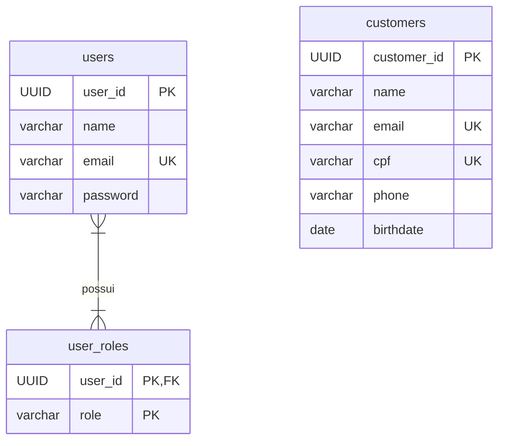

# NeoCustomers API


API REST para o desafio técnico da NeoApp, focada no cadastro e gerenciamento de clientes pessoa física. O projeto foi desenvolvido com ênfase em arquitetura de software robusta, boas práticas de código, segurança e testabilidade.

---

## Tabela de Conteúdos

1.  [Sobre o Projeto](#sobre-o-projeto)
2.  [Processo Criativo e Decisões de Arquitetura](#processo-criativo-e-decisões-de-arquitetura)
3.  [Modelagem de Dados](#modelagem-de-dados)
4.  [Principais Funcionalidades](#principais-funcionalidades)
5.  [Tecnologias Utilizadas](#tecnologias-utilizadas)
6.  [Pré-requisitos](#pré-requisitos)
7.  [Como Executar](#como-executar-com-docker)
8.  [Documentação da API (Swagger)](#documentação-da-api-swagger)
9.  [Como Usar a API](#como-usar-a-api-fluxo-essencial)
10. [Considerações finais](#Considerações-finais)

---

## Sobre o Projeto

Este projeto implementa um MVP de uma API REST para gerenciar um cadastro de clientes, conforme solicitado pelo desafio técnico da NeoApp. A API permite a inclusão, edição, listagem paginada, busca e exclusão de clientes.

Todas as operações de gerenciamento são protegidas por um sistema de autenticação stateless baseado em **JWT (JSON Web Token)**, garantindo que apenas usuários autorizados possam manipular os dados dos clientes.

O sistema tem **89%** classes e **90%** linhas de **COVERAGE de teste.**

---

## Processo Criativo e Decisões de Arquitetura

Para este desafio, optei por uma **Arquitetura em Camadas** com uma forte separação de responsabilidades, inspirada nos princípios do **Domain-Driven Design (DDD)** e na utilização de Ports and Adapters, que venho estudando sobre. O objetivo foi isolar a lógica de negócio de detalhes de tecnologia, como o banco de dados ou o framework web.

OBS: O único infringimento que cometi a respeito do isolamento entre a lógica e o framework foi a utilização do Page/Pageable no ICustomerApplicationService e ICustomerRepository. Preferi não utilizar para este MVP.

A estrutura do projeto é dividida em três camadas principais:

* **`domain`**: Contém as entidades de negócio puras (`User`, `Customer`), e **Value Objects** (`CPF`, `Email`, `BirthDate`) que garantem a integridade dos dados através de validações em seus construtores. E também contém as interfaces de repositório (**Ports**).

* **`application`**: A camada que orquestra os casos de uso do sistema (ex: `CustomerApplicationService`, `AuthService`).

* **`infrastructure`**: Contém todos os detalhes de tecnologia. Onde estão os **Controllers**, a implementação dos **Repositórios** com Spring Data JPA (**Adapter**), e toda a configuração de segurança com Spring Security.

Uma decisão de design importante foi separar os conceitos de `User` (operador do sistema, focado em autenticação) e `Customer` (o dado de negócio). Porque percebi que no enunciado os Customers estavam sendo tratados como "dados" ou, como no enunciado, "registros". Isso garante que as responsabilidades de segurança e de gerenciamento de dados fiquem claramente delimitadas em seus próprios contextos.

---

## Modelagem de Dados

A persistência de dados foi modelada com tabelas distintas para separar as responsabilidades de autenticação e de dados de negócio.



---

## Principais Funcionalidades

* ✔️ **Gerenciamento de Clientes (CRUD):** Inclusão, edição, listagem e exclusão de registros.
* ✔️ **Paginação e busca pelo atributo nome:** Listagem de clientes de forma paginada e busca por nome.
* ✔️ **Lógica de Negócio:** Cálculo automático da idade do cliente com base na data de nascimento.
* ✔️ **Segurança:** Autenticação de usuários com JWT. Endpoints de gerenciamento de clientes protegidos, exigindo um token válido com permissão `USER_ADMIN`.
* ✔️ **Documentação:** API documentada com **OpenAPI 3 (Swagger UI)**.

---

## Tecnologias Utilizadas

* **Linguagem:** Java 21
* **Framework:** Spring Boot 3
* **Segurança:** Spring Security 6
* **Persistência:** Spring Data JPA / Hibernate
* **Banco de Dados:** PostgreSQL 16
* **Build Tool:** Maven
* **Documentação:** Springdoc OpenAPI v2
* **Containerização:** Docker e Docker Compose
* **Testes:** JUnit 5, Mockito, AssertJ
* **Utilitários:** Lombok

---

## Pré-requisitos

* JDK 21+
* Apache Maven 3.8+
* Docker Compose.
* Git.

---

## Como Executar

A forma mais simples de executar o projeto é utilizando o Docker Compose.

**1. Clone o repositório:**
```bash
git clone https://github.com/devrafael-santos/NeoCustomers.git
cd NeoCustomers
```

**2. Configure as Variáveis de Ambiente:**
```bash
# Copie o arquivo de exemplo para criar seu arquivo de configuração local
cp .env.example .env
```
*O arquivo `.env` contém valores demosntrativos para o ambiente Docker e está no `.gitignore` por segurança.*

**3. Suba os Contêineres:**
Execute o seguinte comando na raiz do projeto.
```bash
docker-compose up --build
```
A API estará disponível em `http://localhost:8080/api/v1/`. **A aplicação iniciará sem nenhum usuário pré-cadastrado.** Siga a seção abaixo para criar o primeiro usuário administrador.

---

## Documentação da API

A documentação interativa da API, com todos os endpoints e modelos, está disponível em:

* **Swagger UI:** [http://localhost:8080/api/v1/swagger-ui/index.html](http://localhost:8080/api/v1/swagger-ui/index.html)

---

## Como Usar a API

Para testar a API, o primeiro passo é registrar um usuário com permissão de administrador. Em seguida, use as credenciais desse usuário para se autenticar e obter um token JWT.

#### 1. No proprio **Swagger UI** ou em uma aplicação para requisições HTTPs, registre o primeiro Usuário Administrador
**Request:** `POST /api/v1/auth/register`
```json
{
  "name": "Admin NeoApp",
  "email": "admin@neoapp.com",
  "password": "umaSenhaForte123",
  "confirmPassword": "umaSenhaForte123",
  "roles": ["USER_ADMIN"]
}
```

#### 2. Autentique e Obtenha um Token
**Request:** `POST /api/v1/auth/login`
```json
{
  "email": "admin@neoapp.com",
  "password": "umaSenhaForte123"
}
```
**Response:**
```json
{
  "token": "seu.jwt.aqui"
}
```

#### 3. Gerencie os Clientes
Agora, com o token obtido, você pode adicionar ao header (caso esteja utilizando uma aplicação de requisições HTTPs) ou adiciona na autenticação **"bearerAuth"** dentro de **"Authorize"**, no **Swagger UI**. Com isso, você consegue testar os endpoints protegidos de `/api/v1/customers`.

---

## Considerações finais

Obrigado pela oportunidade!

Com este desafio, consegui por em pratica os assuntos que venho estudando sobre DDD e um pouco de arquitetura e design patterns. Consegui me desafiar **MUITO** desenvolvendo esse sistema, me divertir solucionando os desafios que apareciam durante o desenvolvimento e pude aprender um pouco mais sobre arquitetura, DDD, SOLID, design patterns e deploy!
